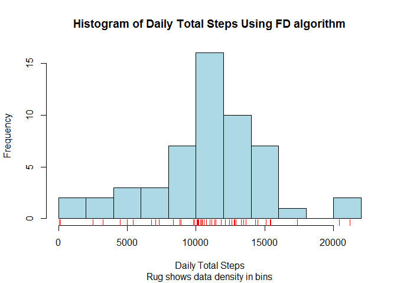
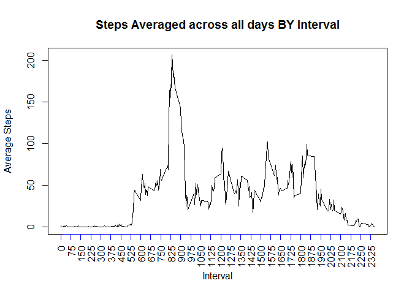
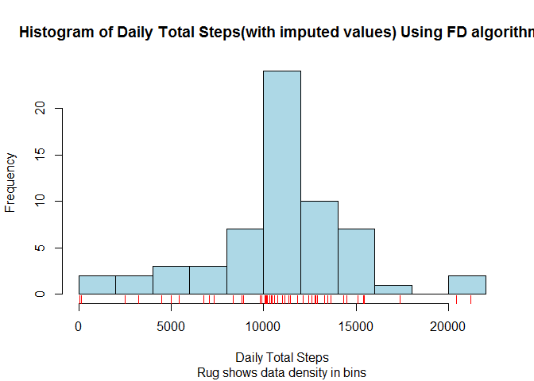
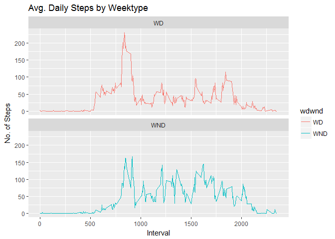

# Reproducible Research - Project 1
Jagannath Gharpure  
July 26, 2017  


## R Markdown

unzip the zip in working directory.  Then read activity.csv from working diectory into data. Use StringsAsfactors=FALSE to ensure date column will be of calss date and not Factors. need lubridate package if we want to handle dates


```
## 
## Attaching package: 'lubridate'
```

```
## The following object is masked from 'package:base':
## 
##     date
```

```
##   steps       date interval
## 1    NA 2012-10-01        0
## 2    NA 2012-10-01        5
## 3    NA 2012-10-01       10
## 4    NA 2012-10-01       15
## 5    NA 2012-10-01       20
## 6    NA 2012-10-01       25
```
    Now we will total daily steps and draw histogram. We will use FD algorithm instead of Sturges algorithm (which is default). We will also draw a rug below histogram so we can see in which bins data is concentrated 
<!-- -->

Now we will Calculate and report the mean and median of the total number of steps taken per day

Daily Total Steps mean = 1.0766189\times 10^{4}

Daily Total Median = 10765

Now we will draw a time series plot.

<!-- -->

Now we wil answer: Which 5-minute interval, on average across all the days in the dataset, contains the maximum number of steps?


```
##     interval    steps
## 104      835 206.1698
```
The interval = 835 has max steps = 206.1698113

Now we will Calculate and report the total number of missing values in the dataset (i.e. the total number of rows with NAs)


```
## [1] 2304
```

The number of rows with missing values (NAs) in steps column = 2304

Now we will Devise a strategy for filling in all of the missing values in the dataset. We will impute the NA values by using the mean for that 5-minute interval 


```
## Warning: Installed Rcpp (0.12.12) different from Rcpp used to build dplyr (0.12.11).
## Please reinstall dplyr to avoid random crashes or undefined behavior.
```

```
## 
## Attaching package: 'dplyr'
```

```
## The following objects are masked from 'package:lubridate':
## 
##     intersect, setdiff, union
```

```
## The following objects are masked from 'package:stats':
## 
##     filter, lag
```

```
## The following objects are masked from 'package:base':
## 
##     intersect, setdiff, setequal, union
```

```
## # A tibble: 6 x 4
##   steps.x       date interval   steps.y
##     <int>      <chr>    <int>     <dbl>
## 1      NA 2012-10-01        0 1.7169811
## 2      NA 2012-10-01        5 0.3396226
## 3      NA 2012-10-01       10 0.1320755
## 4      NA 2012-10-01       15 0.1509434
## 5      NA 2012-10-01       20 0.0754717
## 6      NA 2012-10-01       25 2.0943396
```

```
## # A tibble: 6 x 4
##   steps.x       date interval   steps.y
##     <int>      <chr>    <int>     <dbl>
## 1      NA 2012-11-30     2330 2.6037736
## 2      NA 2012-11-30     2335 4.6981132
## 3      NA 2012-11-30     2340 3.3018868
## 4      NA 2012-11-30     2345 0.6415094
## 5      NA 2012-11-30     2350 0.2264151
## 6      NA 2012-11-30     2355 1.0754717
```

```
## # A tibble: 6 x 4
##     steps.x       date interval   steps.y
##       <dbl>      <chr>    <int>     <dbl>
## 1 1.7169811 2012-10-01        0 1.7169811
## 2 0.3396226 2012-10-01        5 0.3396226
## 3 0.1320755 2012-10-01       10 0.1320755
## 4 0.1509434 2012-10-01       15 0.1509434
## 5 0.0754717 2012-10-01       20 0.0754717
## 6 2.0943396 2012-10-01       25 2.0943396
```

```
## # A tibble: 6 x 4
##     steps.x       date interval   steps.y
##       <dbl>      <chr>    <int>     <dbl>
## 1 2.6037736 2012-11-30     2330 2.6037736
## 2 4.6981132 2012-11-30     2335 4.6981132
## 3 3.3018868 2012-11-30     2340 3.3018868
## 4 0.6415094 2012-11-30     2345 0.6415094
## 5 0.2264151 2012-11-30     2350 0.2264151
## 6 1.0754717 2012-11-30     2355 1.0754717
```
From above head and tail prints we see that we have filled in step.x (which was NA) with the steps.y values.  This satisfies the assignment requirement --> "Create a new dataset that is equal to the original dataset but with the missing data (NA) filled in."


Now we will Make a histogram of the total number of steps taken each day and Calculate and report the mean and median total number of steps taken per day. Do these values differ from the estimates from the first part of the assignment? What is the impact of imputing missing data on the estimates of the total daily number of steps?

<!-- -->

Now we will Calculate and report the mean and median of the total number of steps taken per day with imputed data


Daily Total Steps mean = 1.0766189\times 10^{4}

Daily Total Median = 1.0766189\times 10^{4}

We see that the difference, mean without impute - mean with imputed data = 0

and the difference, median without impute - median with imputed data = -1.1886792

Now  (1) Create a new factor variable in the dataset with two levels - "weekday" ("WD") and "weekend" ("WND")indicating whether a given date is a weekday or weekend day. and then

(2) Make a panel plot containing a time series plot (i.e. type = "l") of the 5-minute interval (x-axis) and the average number of steps taken, averaged across all weekday days or weekend days (y-axis). 


```
## # A tibble: 6 x 3
## # Groups:   interval [3]
##   interval wdwnd avg_steps2
##      <int> <chr>      <dbl>
## 1        0    WD 2.25115304
## 2        0   WND 0.21462264
## 3        5    WD 0.44528302
## 4        5   WND 0.04245283
## 5       10    WD 0.17316562
## 6       10   WND 0.01650943
```

<!-- -->

QUESTION: Are there differences in activity patterns between weekdays and weekends?

Answer: Yes, there are differences. It seems the individual is active at start of the weekdays but not much after that. But during weekend the individual is active throughout.

a========================================================================a
